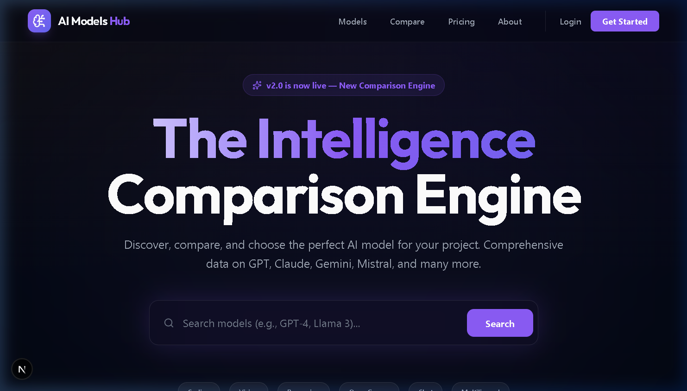
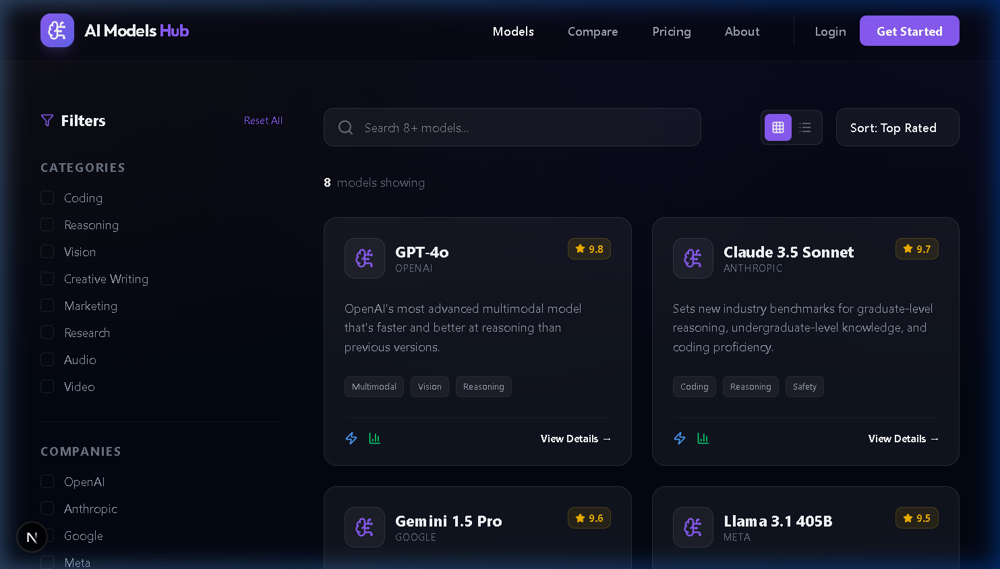
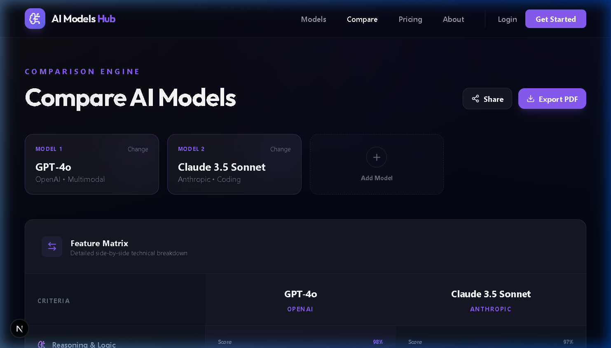
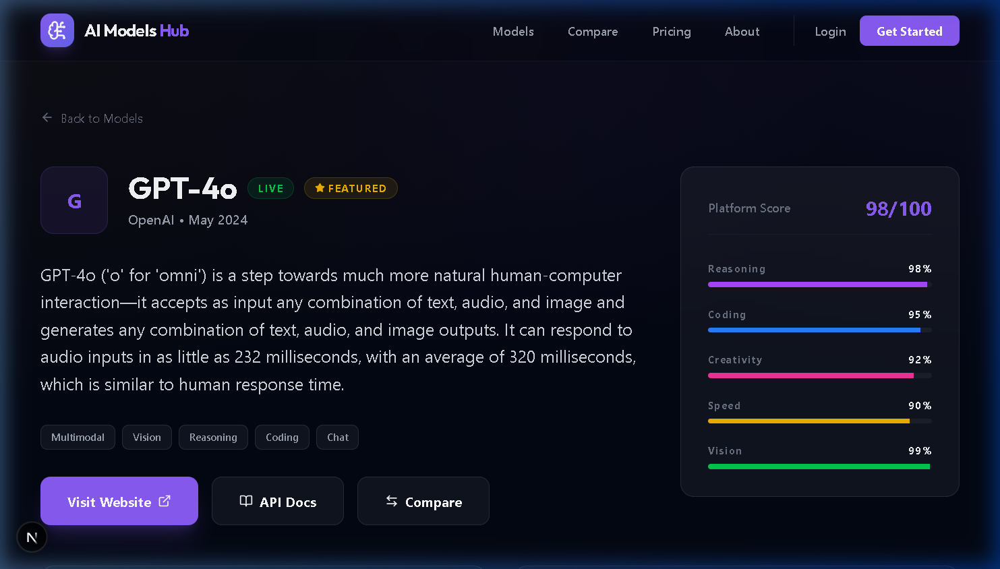
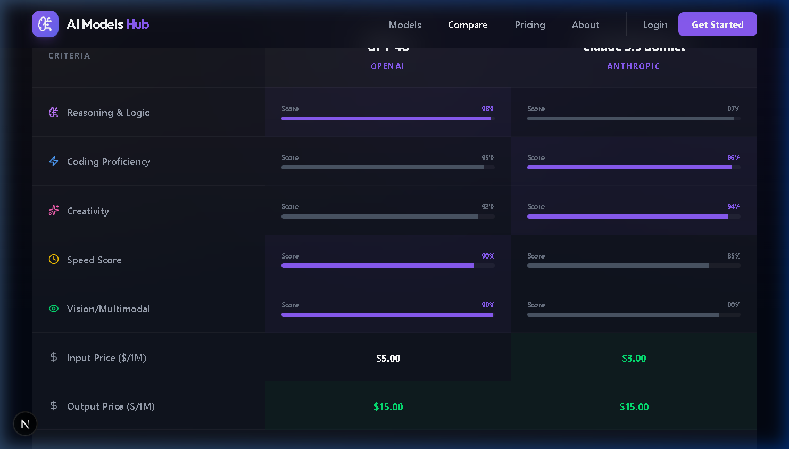

# 🚀 Software Performance Hub: The Ultimate Comparison Engine

**Architected and Developed by:** Ahmed Maamoun

---

## 📖 Overview

Software Performance Hub is a premium, high-performance web platform designed to compare, analyze, and discover the best software tools for any task. From technical benchmarks to pricing and capabilities, it provides a comprehensive, interactive view of the software landscape. 

---

## 📸 Platform Previews

<div align="center">
  
</div>
<br/>
<div align="center">
  
  
</div>
<br/>
<div align="center">
  
  
</div>

---

## ✨ Core Engineering Features

- **Dynamic Comparison Engine:** Side-by-side technical evaluation with custom weighting parameters.
- **Data Visualization:** Interactive feature matrices and performance charts.
- **Sub-Second Search:** Instantaneous global search and deep-filtering using a customized indexing strategy.
- **Modern Architecture:** Built with Next.js App Router and server-side rendering for optimal SEO and performance.

---

## 🧠 Technical Challenges I Overcame

Building an interactive comparison matrix for thousands of data points requires strict performance optimization:

1. **Complex Matrix Rendering:**
   - *Challenge:* Rendering a dense comparison matrix (e.g., 5 software models × 100 features) in React causes significant DOM bloat, leading to slow scrolling and delayed interactions.
   - *Solution:* I implemented CSS Grid with DOM virtualization. Only the visible rows and columns of the matrix are rendered in the DOM, allowing the application to handle massive datasets while maintaining a perfect 60fps scroll performance.
2. **Dynamic Route Generation & SEO:**
   - *Challenge:* Generating static pages for every possible software comparison permutation is impossible (O(n²)).
   - *Solution:* I utilized Next.js incremental static regeneration (ISR) with dynamic edge caching. Common comparisons are statically generated at build time, while niche comparisons are server-rendered on the fly and cached at the edge, guaranteeing instant load times for users and search engine bots.

---

## 🛠️ Technology Stack

| Layer | Technology |
| :--- | :--- |
| **Frontend Platform** | Next.js, React, Tailwind CSS |
| **Data Visualization** | Recharts, Framer Motion |
| **Backend & Indexing** | Node.js, Prisma |

---

## 🚀 Quick Start

1. **Clone the repository:**
   ```bash
   git clone https://github.com/Maamoun0/models-hub.git
   cd models-hub
   ```

2. **Install Dependencies & Start:**
   ```bash
   npm install
   npm run dev
   ```

---

## 👨‍💻 Author

**Ahmed Maamoun**
- GitHub: [@Maamoun0](https://github.com/Maamoun0)
- LinkedIn: [Ahmed Maamoun](https://linkedin.com/in/your-linkedin-profile)

Engineered with surgical precision by Ahmed Maamoun.
